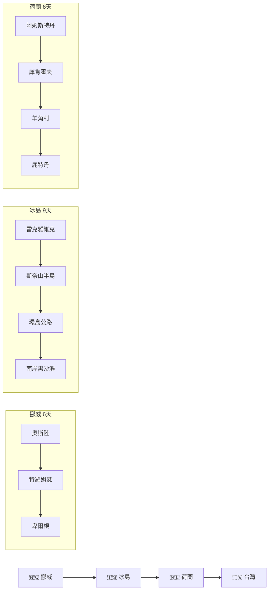

# 🌍 2027 歐洲夢幻之旅行程規劃器

<div align="center">


**一個精心設計的旅行規劃應用程式，專為 2027 年挪威、冰島、荷蘭三國 21 天夢幻行程打造**

[🔗 在線預覽](https://dufuwa.github.io/my-trip/) · [📝 問題回報](https://github.com/Dufuwa/my-trip/issues)

</div>

---

## ✨ 功能特色

| 功能 | 說明 |
|------|------|
| 📅 **行程管理** | 21 天詳細行程規劃，支援新增、編輯、刪除行程 |
| ✈️ **機票追蹤** | 記錄航班資訊，自動連結 Google Flights 比價 |
| 🏨 **住宿管理** | 住宿資訊管理，連結 Airbnb 和 Booking.com 搜尋 |
| 💰 **預算計算** | 即時計算交通、住宿、活動費用總計 |
| ☑️ **待辦清單** | 出發前準備事項清單 |
| 🔥 **即時同步** | 使用 Firebase Firestore 雲端同步資料 |

---

## 🗺️ 行程路線



| 國家 | 天數 | 必遊景點 |
|------|------|----------|
| 🇳🇴 **挪威** | 6 天 | 奧斯陸歌劇院、北極光、布呂根木屋、挪威縮影峽灣 |
| 🇮🇸 **冰島** | 9 天 | 教會山、眾神瀑布、藍湖溫泉、傑古沙龍冰河湖、黃金圈 |
| 🇳🇱 **荷蘭** | 6 天 | 庫肯霍夫鬱金香、運河遊船、羊角村、鹿特丹現代建築 |

---

## 🖥️ 技術架構

```
my-trip/
├── 📁 src/
│   ├── 📄 App.jsx          # 主應用程式元件
│   ├── 📄 main.jsx         # 應用程式入口
│   ├── 📄 index.css        # 全域樣式
│   └── 📄 App.css          # 元件樣式
├── 📁 public/
│   └── 🖼️ vite.svg         # 網站圖標
├── 📄 vite.config.js       # Vite 設定與預設行程資料
├── 📄 tailwind.config.js   # Tailwind CSS 設定
└── 📄 package.json         # 專案依賴
```

### 使用技術

- **前端框架**: React 18.3 + Vite 7.2
- **樣式框架**: Tailwind CSS 3.4
- **圖標庫**: Lucide React
- **後端服務**: Firebase Firestore (即時資料庫)
- **認證服務**: Firebase Anonymous Auth
- **部署**: GitHub Pages

---

## 🚀 快速開始

### 環境需求

- Node.js 18.0 或以上版本
- npm 或 yarn 套件管理器

### 安裝步驟

```bash
# 1. 克隆專案
git clone https://github.com/Dufuwa/my-trip.git
cd my-trip

# 2. 安裝依賴
npm install

# 3. 啟動開發伺服器
npm run dev

# 4. 開啟瀏覽器
# 訪問 http://localhost:5173/my-trip/
```

### 建置部署

```bash
# 建置生產版本
npm run build

# 預覽生產版本
npm run preview

# 部署至 GitHub Pages
npm run deploy
```

---

## 📸 應用程式截圖

<div align="center">

### 行程總覽
精美的行程卡片設計，清楚顯示每日行程、住宿與花費

### 預算管理
即時計算住宿、交通、活動費用，掌握旅行預算

### 機票追蹤
記錄航班資訊，一鍵連結航班比價網站

</div>

---

## 🔧 設定說明

### Firebase 設定

如需使用自己的 Firebase 專案，請修改 `src/App.jsx` 中的設定：

```javascript
const firebaseConfig = {
  apiKey: "YOUR_API_KEY",
  authDomain: "YOUR_PROJECT.firebaseapp.com",
  projectId: "YOUR_PROJECT_ID",
  storageBucket: "YOUR_PROJECT.appspot.com",
  messagingSenderId: "YOUR_SENDER_ID",
  appId: "YOUR_APP_ID"
};
```

### GitHub Pages 部署設定

確認 `vite.config.js` 中的 `base` 設定與您的 Repo 名稱相符：

```javascript
export default defineConfig({
  base: '/my-trip/', // 改為您的 Repository 名稱
  plugins: [react()],
})
```

---

## 📝 版本紀錄

| 版本 | 日期 | 更新內容 |
|------|------|----------|
| v1.0.0 | 2024-12 | 初始版本釋出 |

---

## 📄 授權條款

本專案採用 [MIT License](https://opensource.org/licenses/MIT) 授權。

---

<div align="center">

**🌟 如果這個專案對您有幫助，請給一顆星星！**

Made with ❤️ for the 2027 Dream Trip

</div>
